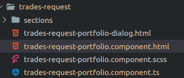

# Recomendaciones cuando se usan diálogos


## Usar su propia carpeta
Siempre que se cree un dialogo se debe crear en su propio componente con su propia carpeta, ts, html, y scss. 

Hay que evitar cosas como la siguiente:



En donde en el fichero `trades-request-portfolio.component.ts` existen definidos dos componentes: `TradesRequestPortfolioComponent` y `TradesRequestPortfolioComponentDialog`. 

Lo recomendable sería tener cada componente en su propia carpeta.

## Convención de nombre
Es recomendable que los componentes de diálogo vayan con el sufijo `-DialogComponent` en el caso anterior lo ideal es que el componente de diálogo se llame `TradesRequestPortfolioDialogComponent` en lugar de `TradesRequestPortfolioComponentDialog` y sus ficheros asociados serían:
- `trades-request-portfolio-dialog.component.ts`
- `trades-request-portfolio-dialog.component.html`
- `trades-request-portfolio-dialog.component.scss`

## No incluir `selector`
Los componente de dialogo no deberían incluir sección `selector` en el decorador `@Component`. Por ejemplo

```ts
@Component({
  selector: 'app-trades-request-portfolio-dialog',
  templateUrl: 'trades-request-portfolio-dialog.component.html',
  styleUrls: ['./trades-request-portfolio-dialog.component.scss']
})
export class TradesRequestPortfolioDialogComponent {
//...
```

debería quedar así:
```ts
@Component({
  templateUrl: 'trades-request-portfolio-dialog.component.html',
  styleUrls: ['./trades-request-portfolio-dialog.component.scss']
})
export class TradesRequestPortfolioDialogComponent {
//...
```

Esto es recomendable por que un diálogo siempre se usará con algo como:
```ts
const dialogRef = this.dialog.open(TradesRequestPortfolioDialogComponent, {
    //..
});
```

Y nunca se usará con algo como:
```html
<app-trades-request-portfolio-dialog>
</app-trades-request-portfolio-dialog>
```

Si quitamos el `selector` evitaremos usarlos por error de la segunda forma (Esto nos podría pasar si por qué existe un componente que tiene un nombre similar a nuestro diálogo)

## Uso de `interface` para almacenar los datos
Siempre que creemos un nuevo dialogo es recomendable acompañarlo con una interfaz como la siguiente:

```ts
export interface ImageChangeDialogData {
  entityId: number;
  entityType: EntityType;
}

@Component({
  selector: 'app-image-change-dialog',
  templateUrl: './image-change-dialog.component.html',
  styleUrls: ['./image-change-dialog.component.scss'],
})
export class ImageChangeDialogComponent implements OnInit, OnDestroy {
    //...
    constructor(    
    @Inject(MAT_DIALOG_DATA) public data: ImageChangeDialogData,
    //..
    ){
        //...
```

En este caso tenemos un componente de diálogo llamado `ImageChangeDialogComponent` cuya propiedad `data` del `constructor` es del tipo `ImageChangeDialogData`. Con esto conseguimos que cuando se haga una instancia del diálogo se pueda pasar los datos de forma tipada, 

```ts
  const dialogRef = this.dialog.open(ImageChangeDialogComponent, {
      data: {
        entityId: this.customer.id,
        entityType: EntityType.User,
      } as ImageChangeDialogData,
    });
```

Asi evitamos usar un `any` para `data` y tenemos un control mínimo de los tipos, y podremos descubrir bugs en tiempo compilación en caso de que no le pasemos los tipos adecuados.

## Usar siempre `afterClosed` después de abrir un diálogo
Siempre que abramos un diálogo es recomendable controlar que se hace con la respuesta para asegurarnos que cuando, por ejemplo, se cierra el dialogo sin darle a guardar, no se realizar ninguna acción
```ts
const dialogRef = this.dialog.open(ImageChangeDialogComponent, {
    data: {
    entityId: this.customer.id,
    entityType: EntityType.User,
    } as ImageChangeDialogData,
});

dialogRef.afterClosed().subscribe((user) => {
    if (user) {
        this.userUpdated.emit(user);
    } else {
        this.log.debug('dialog rejected');
    }
});

```
Con esto evitaremos hacer llamadas a endpoints cuando no corresponde y cosas similares.

## Estilo por defecto para los diálogos
Usar el siguiente estilo evita algunos problemas de visualización comunes en los diálogos:
```scss
:host {
  height: 100%;
  flex-direction: column;
  display: flex;
  padding-bottom: 1rem;
}

.mat-dialog-content {
  max-height: 100%;
}
```
Esta recomendación es opcional por que dependerá de las circunstancias del diálogo.
