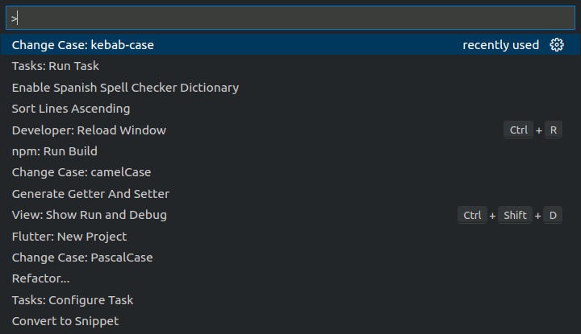

# Atajos de teclas recomendadas

(Algunos atajos pueden variar dependiendo del sistema operativo)

## `ctrl + shift + i`
Para formatear el código del fichero actual.

## `alt + shift + u` 
Elimina los imports no utilizados.

## `ctrl + b`
Para ocultar/mostrar los paneles laterales que hay en la izquierda. 
Es útil cuando se necesita de forma temporal un extra de ancho en la pantalla.

## `ctrl + shift + f`
Para buscar un texto en algún fichero de nuestro proyecto

## `ctrl + p`
Para abrir un fichero buscándolo por su nombre

## `ctrl + shift + p`
Muestra un listado de acciones disponibles como el siguiente:

