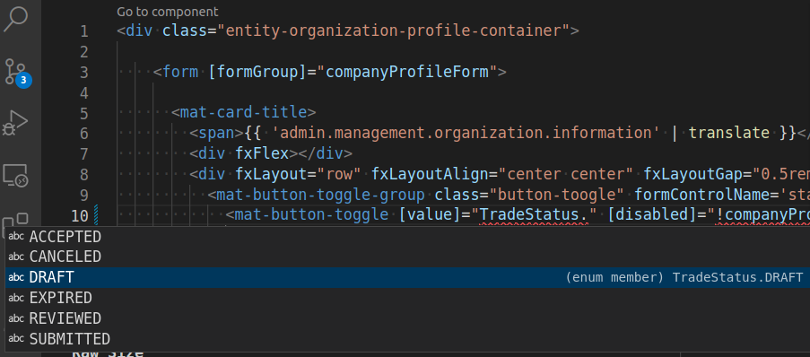

# ¿Cómo usar enums desde la plantilla de un componente?

Si por ejemplo tenemos el siguiente enum:

```ts
export enum TradeStatus {
  DRAFT = 'draft',
  REVIEWED = 'reviewed',
  SUBMITTED = 'submitted',
  ACCEPTED = 'accepted',
  CANCELED = 'canceled',
  EXPIRED = 'expired'
}
```

y quiseramos utilizarlo por ejemplo en `entity-organization-profile.component.html`, deberíamos incluir el siguiente código en el fichero `entity-organization-profile.component.ts` :


```ts 
import { TradeStatus } from '@app/@shared/models/trades';
// ...
@Component({
  selector: 'app-entity-organization-profile',
  templateUrl: './entity-organization-profile.component.html',
  styleUrls: ['./entity-organization-profile.component.scss']
})
export class EntityOrganizationProfileComponent implements OnInit {
  // Añadir esta línea
  TradeStatus = TradeStatus;
// ...
}
```

Y ahora ya podemos utilizarlo en la plantilla:

```html
<!-- Antes -->
<!-- <mat-button-toggle [value]="'draft'" [disabled]="!companyProfileForm.get('comment')?.value">
    {{ 'entities.company.profile.status.draft' | translate }}
</mat-button-toggle> -->

<!-- Ahora -->
<mat-button-toggle [value]="TradeStatus.DRAFT" [disabled]="!companyProfileForm.get('comment')?.value">
    {{ 'entities.company.profile.status.draft' | translate }}
</mat-button-toggle>
```

## Ventajas de utilizar enums
Hay dos ventajas en utilizar enums en lugar de strings fijos:

1. Previene que podamos teclear mal un valor, por ejemplo escribir `phoneNumber` en lugar de `phone_number`

2. Mantiene nuestro código centralizado. Si en algún momento se hicieran cambios en el back y hubiera que cambiar el valor de alguna de las cadenas, solo tendriamos que cambiar los valores del enum. Si no usaramos enums tendríamos que ir buscando el proyecto y daría la posibilidad de dejarnos algún cadena sin actualizar, dando la posibilidad de provocar bugs en el futuro que serán dificiles de detectar.

3. Permite a nuestro editor poder sugerirnos los valores que puede tomar el enum




