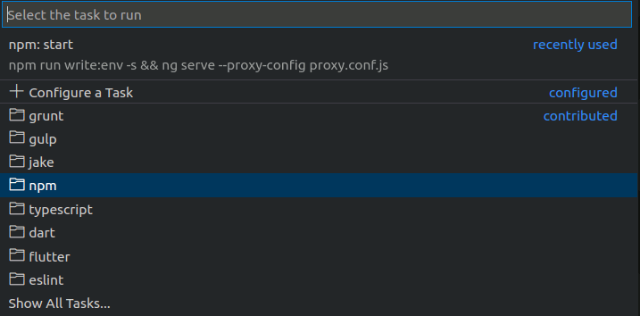
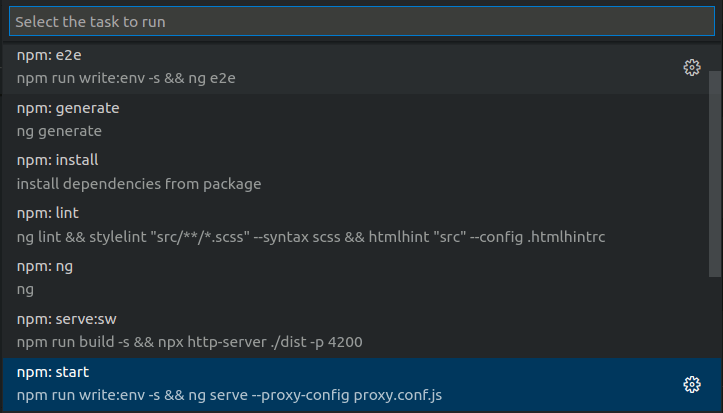
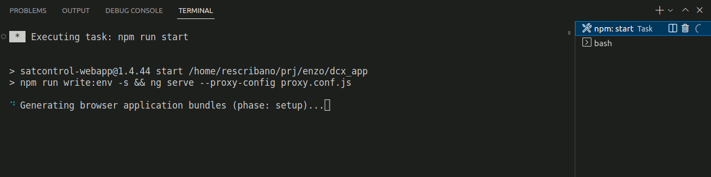

## Uso de `Run task`

Por normal general cuando trabajos con angular y queremos arrancar un proyecto para poderlo depurar en local se suele utilizar en comando `npm start` desde una terminal de nuestro sistema.

Una opción mejor es llamar a `npm start` desde la terminal integrada de VSCode, para poder ver los mensajes al mismo tiempo que tenemos el código al vista.

Una opción todavía mejor es pulsar `ctrl+shift+P` y elegir la opción `Task: Run task` y nos aparecerá un lista de tipos de tareas que se pueden iniciar

Elegimos `npm` y nos dará las opciones que hay dependiendo de nuestro `package.json`

Elegimos `npm:start` y no aparecerá el resultado en una terminal como la siguiente:

La ventajas de utilizar `Run Task` respecto de hacerlo a mano en nuestra terminal integrada son las siguientes:
- La terminal que ejecuta la tarea  aparece con un un icono diferente que el de una terminal normal . Así podremos localizar más fácilmente cual de las terminales es la de la tarea.

- Una vez que se cancela la tarea, la terminal se cierra.

- Si ejecutamos dos veces la misma tarea, no se crea una nueva terminal, si no que se sustituye la existente.

