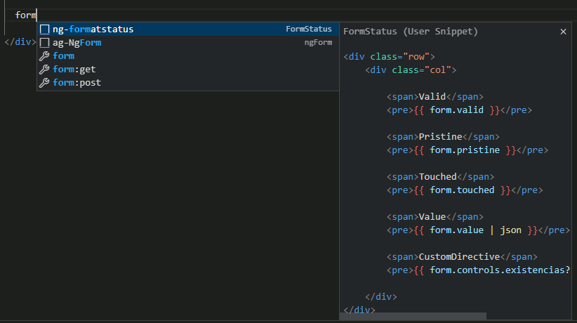
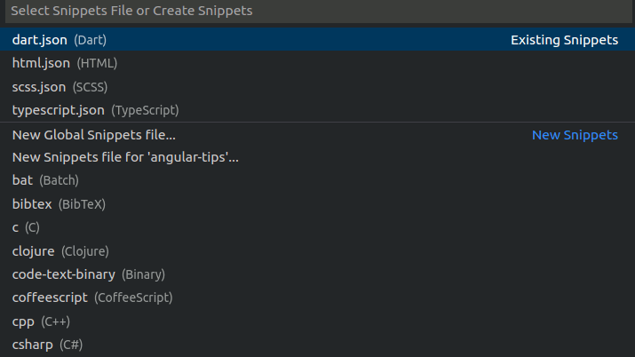
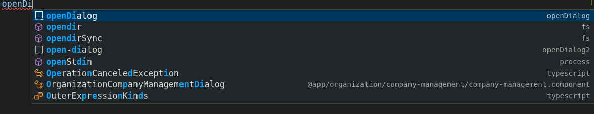
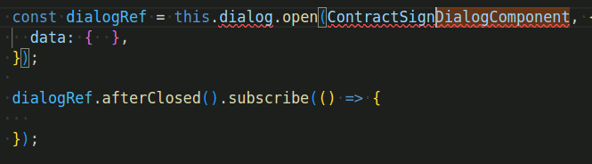

# Uso de snippets en vscode

## Introducción

Los snippets son una herramienta para poder reutilizar fragmentos de código, y evitar tener que escribir a mano ciertos patrones de código que aparecen con cierta frecuencia.


La mayoría de snippets que se suelen utilizar suelen ser snippets de terceros que podemos instalar desde el marketplace de VsCode como por ejemplo [Angular Snippets](https://marketplace.visualstudio.com/items?itemName=johnpapa.Angular2) pero también existe la posibilidad de crear un snippet personalizado para adaptarlo a nuestra forma de trabajar.

## ¿Cómo añadir un snippet personalizado?

- En VSCode vamos a
  `File -> Preferences -> Configure User Snippets`
  se nos abrirá un menú pare elegir el lenguaje
  

- Elegimos el lenguaje que nos interese, por ejemplo `typescript` (Como podéis imaginar si trabajamos con angular por lo general solo necesitaremos `typescript`, `html`, y `scss`)

- Añadimos el siguiente código al final del json:

```json
{
  // ...
  "openDialog": {
    "prefix": "openDialog",
    "body": [
      "const dialogRef = this.dialog.open($1DialogComponent, {",
      "\tdata: { $2 },",
      "});\n",
      "dialogRef.afterClosed().subscribe(($3) => {",
      "\t$4",
      "});"
    ]
  }
}
```

- Y si guardamos el json, ya tendríamos el snippet `openDialog` listo para utilizar en cualquier fichero de typescript.

## ¿Cómo probar en nuevo snippet?

Para probar el nuevo snippet vamos a un archivo `ts` de un componente de angular y dentro de un método probamos a empezar a escribir `openDialog` para ver si aparece un menu como el siguiente:



Seleccionamos `openDialog`, y escribimos por ejemplo `ContractSign` y pulsamos tabulador: Nos aparecerá algo como esto:


No os preocupéis por que aparezca texto subrayado en rojo. Habría que que incluir `private dialog: MatDialog` en el constructor e importar `ContractSignDialogComponent` en nuestro componente

Si vamos presionando `tab` veremos como va pasando de una a una sección a otra de nuestro snippet. Esto es útil para ir añadiendo código en las diferente secciones del snippet. 

Si os fijáis en el código original del snippet (En `typescript.json`) las diferentes secciones por las que se puede navegar con el tabulador vienen dadas por  $1, $2, $3, y $4.

Podéis modificar este snippet y personalizarlo para vuestra necesidades. También se puede duplicarlo y crear un nuevo snippet, en tal caso habría que modificar cómo mínimo el nombre y el prefijo del snippet.

## ¿Cómo crear un snippet desde cero?

Si intentáis añadir más líneas al snippet, os daréis cuenta que es un poco farragoso tener que ir entrecomillando cada línea que se quiera añadir.

Existe una extensión de vscode llamada `Convert text/code to a snippet` que nos puede facilitar un poco esa tarea. Para instalarla pulsar `Ctrl+P` y escribid 
```
  ext install nsfilho.tosnippet
```

Una vez instalada, solo tendríamos que:
- Seleccionar un fragmente de código que queramos convertir en snippet 
- Pulsar `Ctrl+Shift+P` y seleccionar `Convert to snippet`
- Responder a las preguntas sobre el nombre del snippet, el prefijo, etc
- Copiar el código generado en la terminal
- Pegar dicho código en nuestro json de snippets personalizados
- Y personalizar quitando las partes que deseemos sustituir manualmente con $1, $2, etc
